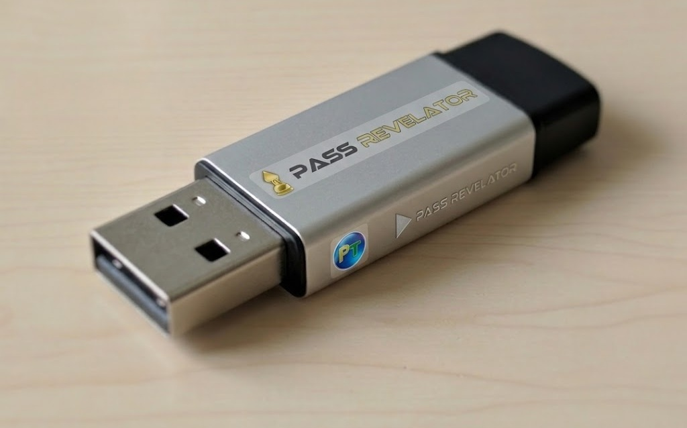

# 🔐 Contourner un mot de passe Windows

**Outil automatisé de réinitialisation des mots de passe Windows. Permet d’effacer le mot de passe d’un compte local et de créer un compte administrateur de secours.**

  

---

## ⚠️ AVERTISSEMENT JURIDIQUE IMPORTANT

**Ce projet ne doit être utilisé que dans un cadre légal et éthique** : laboratoires de test, comptes vous appartenant, ou environnements ayant fait l’objet d’une autorisation écrite explicite.
Tenter de tester ou d’accéder à des comptes sans autorisation est **illégal** et **pénalement répréhensible**. En téléchargeant ou en utilisant ce dépôt, vous acceptez de respecter les règles d’usage responsable.

**Je tiens à remercier l’API PASS REVELATOR qui a permis la réalisation de ce programme. Pour en savoir plus sur la sécurité des mots de passe Windows et les techniques de contournement, je vous invite à visiter leur site : https://passwordrevelator.net/fr/deverrouiller-compte-windows-sans-mot-de-passe**

# PassRevelator – Réinitialisation mot de passe Windows

## 📋 Fonctionnalités

- **Détection automatique** des partitions Windows
- **Extraction des utilisateurs** depuis la base SAM
- **Réinitialisation du mot de passe** (effacement des hashs LM/NT)
- **Création d’un compte administrateur de secours** avec mot de passe vide
- **Fonctionne depuis un environnement WinPE** sans intervention manuelle
- **Journalisation complète** des opérations

## 🏗️ Architecture du code

### Structure principale

#### `SAMHashExtractor`
- Analyse la structure V de la base de registre SAM
- Extrait les informations utilisateur : nom, hash LM, hash NT
- Repère les offsets des champs de mot de passe dans la structure binaire

#### `PassRevelatorLogon`
Classe principale qui coordonne l’ensemble des opérations :

1. **Détection des partitions** (`find_windows_partitions`)
   - Parcourt les lettres de lecteurs de A à Z
   - Vérifie la présence de `Windows\System32\config\SAM`
   - Identifie les installations Windows valides

2. **Extraction des utilisateurs** (`list_users`, `_extract_users_from_sam`)
   - Charge la ruche SAM via `reg load`
   - Liste les RID (identifiants relatifs) des utilisateurs
   - Exporte chaque clé utilisateur avec `reg export`
   - Analyse les données binaires de la structure V
   - Récupère le nom d’utilisateur et ses hashs

3. **Réinitialisation du mot de passe** (`reset_password`)
   - Tente d’abord d’utiliser `chntpw` s’il est présent
   - Sinon, procède par modification directe de la base de registre
   - Met à zéro la longueur des hashs LM et NT dans la structure V
   - Efface les données des hashs pour éviter toute trace résiduelle
   - Réimporte la clé modifiée via `reg import`

4. **Création d’un compte administrateur** (`create_local_admin`)
   - Construit une structure V minimale pour le nouvel utilisateur
   - Construit une structure F avec les indicateurs de compte actif
   - Ajoute l’utilisateur dans `SAM\Domains\Account\Users`
   - Crée le mappage nom → RID dans `Users\Names`
   - Ajoute l’utilisateur au groupe Administrateurs (RID 0x220)
   - Modifie la ruche SOFTWARE pour activer les droits d’administration

### Structures de données SAM

#### Structure V (informations utilisateur)
- Offset 0xCC : début des données variables
- Offset 0x9C : offset relatif du hash LM
- Offset 0xA0 : longueur du hash LM (int32 little-endian)
- Offset 0xA8 : offset relatif du hash NT
- Offset 0xAC : longueur du hash NT (int32 little-endian)

Pour supprimer un mot de passe :
- Mettre les longueurs LM et NT à 0
- Effacer les données de hash aux offsets calculés

#### Structure F (indicateurs du compte)
- Taille : 80 octets (0x50)
- Offset 0x30 : RID de l’utilisateur
- Offset 0x38 : indicateurs du compte (AccountFlags)
  - `0x0010` : UF_NORMAL_ACCOUNT
  - `0x0200` : UF_DONT_EXPIRE_PASSWD
- Offset 0x10 : expiration du compte (0x7FFFFFFFFFFFFFFF = jamais)

## 📝 Journalisation

Toutes les opérations sont enregistrées :
- Dans la console : affichage en temps réel
- Dans un fichier : `C:\PassRevelator_Auto.log`

## 🤝 Assistance

- Site web : https://www.passwordrevelator.net
- E-mail : support@passrevelator.net
- Copyright 2026

## 📄 Licence

Ce logiciel est fourni à des fins éducatives et de récupération système. L’utilisateur est seul responsable de son utilisation conformément aux lois en vigueur.
